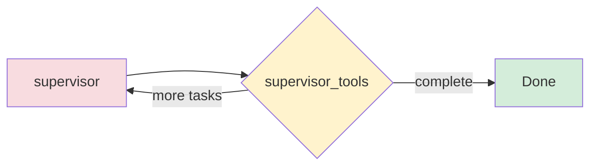
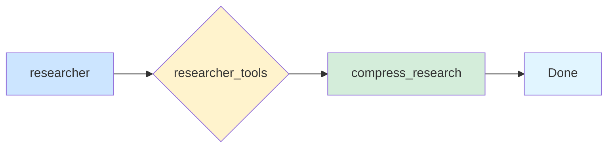

# 🐼 Panda_Dive

> **领域深度搜索工具 - Deep Domain Research Tool**


A powerful multi-agent deep research tool built with LangGraph and LangChain. Panda_Dive orchestrates multiple researcher agents to comprehensively explore any domain, synthesize findings, and generate detailed reports.

---

## ✨ Features

### 🤖 Multi-Agent Research System
- **Supervisory Agent**: Intelligently delegates research tasks to multiple specialized researcher agents
- **Concurrent Execution**: Run up to 20 research tasks in parallel for maximum efficiency
- **Dynamic Task Delegation**: The supervisor adapts based on research progress and findings

### 🧠 Flexible LLM Support
Panda_Dive supports multiple LLM providers out of the box:
- **OpenAI** (GPT-4, GPT-3.5)
- **Anthropic** (Claude 3.5, Claude 3)
- **DeepSeek** (DeepSeek V3)
- **Google** (VertexAI, GenAI)
- **Groq** (Llama, Mixtral)
- **AWS Bedrock**

Configure different models for different research stages:
- Research queries
- Information compression
- Summarization
- Final report generation

### 📊 Smart Token Management
- **Automatic Truncation**: Intelligently handles token limit errors
- **Retry Logic**: Robust retry mechanism for failed tool calls
- **Context Optimization**: Compresses research findings to stay within limits

### 🔧 Extensibility
- **MCP Integration**: Extend tools via Model Context Protocol
- **LangSmith Tracing**: Full observability and debugging support
- **Multiple Search APIs**: Tavily, DuckDuckGo, Exa, ArXiv

---

## 🏗️ Architecture

Panda_Dive uses a sophisticated multi-agent graph architecture:


### Supervisor Subgraph

The supervisor manages research delegation dynamically:



### Researcher Subgraph

Each researcher executes specialized research tasks:



---

## 📦 Installation

### Prerequisites
- Python 3.10 or higher
- API keys for your chosen LLM provider(s)
- (Optional) Tavily API key for web search

### Install from source

```bash
# Clone the repository
git clone https://github.com/yourusername/Panda_Dive.git
cd Panda_Dive
```

#### Linux/macOS

```bash
# Create virtual environment with uv
uv venv
source .venv/bin/activate

# Install dependencies
uv sync
```

#### Windows

```bash
# Create virtual environment
python -m venv venv
.\venv\Scripts\Activate

# Install uv and dependencies
pip install uv
uv pip install -r pyproject.toml
```

#### Alternative: Using pip directly

```bash
# Create virtual environment
python -m venv .venv

# Activate (Linux/macOS: source .venv/bin/activate, Windows: .venv\Scripts\activate)
source .venv/bin/activate

# Install in editable mode
pip install -e .
```

#### Development setup

```bash
# Install with development dependencies
pip install -e ".[dev]"
```

### Configuration

Copy the example environment file and configure your API keys:

```bash
# Linux/macOS
cp .env.example .env

# Windows
copy .env.example .env
```

Edit `.env` with your credentials:

```bash
OPENAI_API_KEY=your_openai_key
ANTHROPIC_API_KEY=your_anthropic_key
GOOGLE_API_KEY=your_google_key
TAVILY_API_KEY=your_tavily_key
LANGSMITH_API_KEY=your_langsmith_key
LANGSMITH_PROJECT=panda_dive
```

---

## 🚀 Quick Start

### Basic Usage

```python
from Panda_Dive import Configuration, deep_researcher
from langchain_core.messages import HumanMessage

# Configure the researcher
config = Configuration(
    search_api="tavily",
    max_researcher_iterations=6,
    max_concurrent_research_units=4,
    allow_clarification=True,
    model="openai:gpt-4o"
)

# Start research
topic = "What are the latest developments in quantum computing?"

result = deep_researcher.invoke(
    {"messages": [HumanMessage(content=topic)]},
    config=config.to_runnable_config()
)

print(result["messages"][-1].content)
```

### Using Different LLM Providers

```python
# Use Anthropic Claude
config = Configuration(model="anthropic:claude-3-5-sonnet-20241022")

# Use DeepSeek
config = Configuration(model="deepseek:deepseek-chat")

# Use Google VertexAI
config = Configuration(model="google:gemini-2.0-flash-001")
```

---

## ⚙️ Configuration

### Key Options

| Parameter | Type | Default | Description |
|-----------|------|---------|-------------|
| `search_api` | str | `"tavily"` | Search API to use: `tavily`, `duckduckgo`, `exa`, `arxiv`, or `none` |
| `max_researcher_iterations` | int | `6` | Maximum iterations per researcher (1-10) |
| `max_react_tool_calls` | int | `6` | Maximum tool calls per reaction (1-30) |
| `max_concurrent_research_units` | int | `4` | Parallel research tasks (1-20) |
| `allow_clarification` | bool | `True` | Ask clarifying questions before research |
| `model` | str | `"openai:gpt-4o"` | Default model for research |

### Advanced Configuration

```python
config = Configuration(
    # Search settings
    search_api="tavily",
    max_researcher_iterations=8,

    # Concurrency
    max_concurrent_research_units=8,

    # Different models for different stages
    model="openai:gpt-4o",                    # Research model
    compress_model="anthropic:claude-3-5-sonnet",  # Compression
    summarize_model="openai:gpt-4o-mini",    # Summarization
    report_model="openai:gpt-4o",             # Final report

    # Clarification
    allow_clarification=False,  # Skip questions for speed
)
```

---

## 🔍 How It Works

### Research Process

1. **Clarification** (Optional)
   - Asks clarifying questions to understand research scope
   - User can confirm or modify the research brief

2. **Research Brief Generation**
   - Creates a structured brief based on the topic
   - Identifies key areas to investigate

3. **Supervised Research**
   - Supervisor delegates specific research tasks
   - Multiple researcher agents work in parallel
   - Each researcher explores their assigned subtopic

4. **Research Synthesis**
   - Compresses individual findings to fit context
   - Synthesizes cross-cutting insights

5. **Final Report**
   - Generates comprehensive, well-structured report
   - Includes citations and sources

---

## 🧪 Development

### Running Tests

```bash
# Run all tests
python -m pytest

# Run with verbose output
python -m pytest -v

# Run with coverage
python -m pytest --cov=Panda_Dive

# Run specific test
python -m pytest src/test_api.py::test_function_name
```

### Linting and Formatting

```bash
# Check code style
ruff check .

# Auto-fix issues
ruff check --fix .

# Type checking
mypy src/Panda_Dive/
```

### Code Style Guidelines

- Python 3.10+ type hints (e.g., `list[str]`, not `List[str]`)
- Google-style docstrings
- Async/await patterns for all graph nodes
- Proper error handling and logging

See [AGENTS.md](AGENTS.md) for detailed development guidelines.

---

## 📂 Project Structure

```
Panda_Dive/
├── src/
│   └── Panda_Dive/
│       ├── __init__.py           # Package exports
│       ├── deepresearcher.py     # Main graph orchestration
│       ├── configuration.py       # Pydantic configuration models
│       ├── state.py               # TypedDict state definitions
│       ├── prompts.py             # System prompts for LLMs
│       └── utils.py               # Tool wrappers and helpers
├── pyproject.toml                # Project configuration
├── .env.example                  # Environment variables template
├── AGENTS.md                     # Agent development guidelines
└── README.md                     # This file
```

---

## 🤝 Contributing

We`welcome contributions! Here`'s how to get started:

1. Fork the repository
2. Create a feature branch (`git checkout -b feature/amazing-feature`)
3. Make your changes following our code style guidelines
4. Run tests and linting (`pytest` and `ruff`)
5. Commit your changes (`git commit -m 'Add amazing feature'`)
6. Push to the branch (`git push origin feature/amazing-feature`)
7. Open a Pull Request

### Development Workflow

- Follow PEP 8 and our ruff configuration
- Add tests for new features
- Update documentation as needed
- Ensure type hints are complete

---

## 📄 License

This project is licensed under the MIT License - see the [LICENSE](LICENSE) file for details.

---

## 🙏 Acknowledgments

Built with:
- [LangGraph](https://langchain-ai.github.io/langgraph/) - Graph-based orchestration
- [LangChain](https://www.langchain.com/) - LLM application framework
- [Pydantic](https://docs.pydantic.dev/) - Data validation

---

## 📞 Support

- 📖 Read the [AGENTS.md](AGENTS.md) for development guidelines
- 🐛 Report issues on [GitHub Issues](https://github.com/yourusername/Panda_Dive/issues)
- 💬 Discussions welcome in [GitHub Discussions](https://github.com/yourusername/Panda_Dive/discussions)

---

<div align="center">

**Made with ❤️ by [PonyPan](https://github.com/PonyPan)**

</div>
