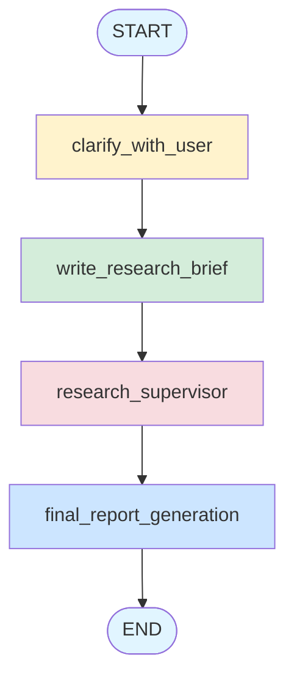
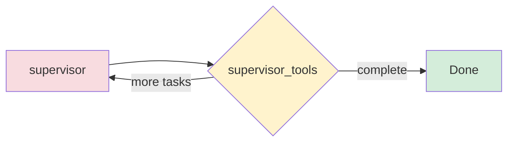
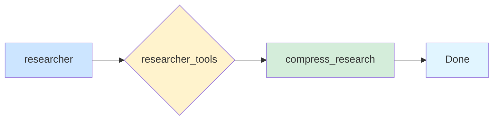

# 🐼 Panda_Dive
# Panda_Dive

> **领域深度搜索工具 - Deep Domain Research Tool**


A powerful multi-agent deep research tool built with LangGraph and LangChain. Panda_Dive orchestrates multiple researcher agents to comprehensively explore any domain, synthesize findings, and generate detailed reports with retrieval quality safeguards.

## 📑 Table of Contents
- [Features](#-features)
- [Architecture](#-architecture)
- [Installation](#-installation)
- [Quick Start](#-quick-start)
- [Configuration](#-configuration)
- [How It Works](#-how-it-works)
- [Documentation](#-documentation)
- [Evaluation](#-evaluation)
- [Development](#-development)
- [Project Structure](#-project-structure)
- [Contributing](#-contributing)
- [License](#-license)
- [Support](#-support)

---

## ✨ Features

### 🤖 Multi-Agent Research System
- **Supervisory Agent**: Intelligently delegates research tasks to multiple specialized researcher agents
- **Concurrent Execution**: Run up to 20 research tasks in parallel for maximum efficiency
- **Dynamic Task Delegation**: The supervisor adapts based on research progress and findings

### 🧠 Flexible LLM Support
Panda_Dive supports multiple LLM providers out of the box:
- **OpenAI** (GPT-4, GPT-3.5)
- **Anthropic** (Claude 3.5, Claude 3)
- **DeepSeek** (DeepSeek V3)
- **Google** (VertexAI, GenAI)
- **Groq** (Llama, Mixtral)
- **AWS Bedrock**

Configure different models for different research stages:
- Research queries
- Information compression
- Summarization
- Final report generation

### 📊 Smart Token Management
- **Automatic Truncation**: Intelligently handles token limit errors
- **Retry Logic**: Robust retry mechanism for failed tool calls
- **Context Optimization**: Compresses research findings to stay within limits

### 🔧 Extensibility
- **MCP Integration**: Extend tools via Model Context Protocol
- **LangSmith Tracing**: Full observability and debugging support
- **Multiple Search APIs**: Tavily, DuckDuckGo, Exa, ArXiv (DuckDuckGo is now the default - privacy-friendly and no API key required)

### 🎯 Retrieval Quality Loop
- **Query Rewriting**: Expand queries to improve recall (supports both Tavily and DuckDuckGo)
- **Relevance Scoring**: Score each result on a 0.0-1.0 scale
- **Reranking**: Prioritize higher-quality sources before synthesis
- **Robust Error Handling**: Graceful handling of connection issues for DuckDuckGo searches

---

## 🏗️ Architecture

Panda_Dive uses a sophisticated multi-agent graph architecture:



### Supervisor Subgraph

The supervisor manages research delegation dynamically:



### Researcher Subgraph

Each researcher executes specialized research tasks:



---

## 📦 Installation

### Prerequisites
- Python 3.10 or higher
- API keys for your chosen LLM provider(s)
- (Optional) Tavily API key if using Tavily search (DuckDuckGo requires no API key)

### Install from source

```bash
# Clone the repository
git clone https://github.com/123yongming/Panda_Dive.git
cd Panda_Dive
```

#### Linux/macOS

```bash
# Create virtual environment with uv
uv venv
source .venv/bin/activate

# Install dependencies
uv sync
```

#### Windows

```bash
# Create virtual environment
python -m venv venv
.\venv\Scripts\Activate

# Install uv and dependencies
pip install uv
uv pip install -r pyproject.toml
```

#### Alternative: Using pip directly

```bash
# Create virtual environment
python -m venv .venv

# Activate (Linux/macOS: source .venv/bin/activate, Windows: .venv\Scripts\activate)
source .venv/bin/activate

# Install in editable mode
pip install -e .
```

#### Development setup

```bash
# Install with development dependencies
pip install -e ".[dev]"
```

### Configuration

Copy the example environment file and configure your API keys:

```bash
# Linux/macOS
cp .env.example .env

# Windows
copy .env.example .env
```

Edit `.env` with your credentials:

```bash
OPENAI_API_KEY=your_openai_key
ANTHROPIC_API_KEY=your_anthropic_key
GOOGLE_API_KEY=your_google_key
TAVILY_API_KEY=your_tavily_key
LANGSMITH_API_KEY=your_langsmith_key
LANGSMITH_PROJECT=panda_dive
```

---

## 🚀 Quick Start

### Basic Usage

```python
from Panda_Dive import Configuration, deep_researcher
from langchain_core.messages import HumanMessage

# Configure the researcher (DuckDuckGo is default - no API key needed!)
config = Configuration(
    max_researcher_iterations=6,
    max_concurrent_research_units=4,
    allow_clarification=True,
    model="openai:gpt-4o"
)

# Start research
topic = "What are the latest developments in quantum computing?"

result = deep_researcher.invoke(
    {"messages": [HumanMessage(content=topic)]},
    config=config.to_runnable_config()
)

print(result["messages"][-1].content)
```

### Using Different LLM Providers

```python
# Use Anthropic Claude
config = Configuration(model="anthropic:claude-3-5-sonnet-20241022")

# Use DeepSeek
config = Configuration(model="deepseek:deepseek-chat")

# Use Google VertexAI
config = Configuration(model="google:gemini-2.0-flash-001")
```

### Using Different Search APIs

```python
# DuckDuckGo (default) - privacy-friendly, no API key required
config = Configuration(search_api="duckduckgo")

# Tavily - requires API key but provides more detailed results
config = Configuration(search_api="tavily")

# ArXiv - for academic paper searches
config = Configuration(search_api="arxiv")
```

---

## ⚙️ Configuration

### Key Options

| Parameter | Type | Default | Description |
|-----------|------|---------|-------------|
| `search_api` | str | `"duckduckgo"` | Search API to use: `duckduckgo` (default), `tavily`, `exa`, `arxiv`, or `none` |
| `max_researcher_iterations` | int | `6` | Maximum iterations per researcher (1-10) |
| `max_react_tool_calls` | int | `6` | Maximum tool calls per reaction (1-30) |
| `max_concurrent_research_units` | int | `4` | Parallel research tasks (1-20) |
| `allow_clarification` | bool | `True` | Ask clarifying questions before research |
| `model` | str | `"openai:gpt-4o"` | Default model for research |
| `query_variants` | int | `3` | Number of query variants for retrieval quality |
| `relevance_threshold` | float | `0.7` | Minimum relevance score threshold |
| `rerank_top_k` | int | `10` | Number of documents after reranking |
| `rerank_weight_source` | str | `"auto"` | Source weighting strategy for reranking |

### Advanced Configuration

```python
# Using DuckDuckGo (default, no API key required)
config = Configuration(
    search_api="duckduckgo",  # Privacy-friendly, no API key needed
    max_researcher_iterations=8,
    max_concurrent_research_units=8,
)

# Using Tavily (requires API key, but provides richer results)
config = Configuration(
    search_api="tavily",
    max_researcher_iterations=8,
    max_concurrent_research_units=8,
    
    # Different models for different stages
    model="openai:gpt-4o",                    # Research model
    compress_model="anthropic:claude-3-5-sonnet",  # Compression
    summarize_model="openai:gpt-4o-mini",    # Summarization
    report_model="openai:gpt-4o",             # Final report

    # Clarification
    allow_clarification=False,  # Skip questions for speed
)
```

---

## 🔍 How It Works

### Research Process

1. **Clarification** (Optional)
   - Asks clarifying questions to understand research scope
   - User can confirm or modify the research brief

2. **Research Brief Generation**
   - Creates a structured brief based on the topic
   - Identifies key areas to investigate

3. **Supervised Research**
   - Supervisor delegates specific research tasks
   - Multiple researcher agents work in parallel
   - Each researcher explores their assigned subtopic

4. **Research Synthesis**
   - Compresses individual findings to fit context
   - Synthesizes cross-cutting insights

5. **Final Report**
   - Generates comprehensive, well-structured report
   - Includes citations and sources

---

## 📚 Documentation

- Retrieval Quality Loop (Phase 1): [docs/retrieval-quality-loop.md](docs/retrieval-quality-loop.md)

---

## 🧪 Evaluation

Panda_Dive includes a comprehensive evaluation framework using LangSmith to benchmark the deep research system against the "Deep Research Bench" dataset.

### Environment Variables

Before running evaluations, ensure these environment variables are set:

| Variable | Required | Description |
|----------|----------|-------------|
| `LANGSMITH_API_KEY` | **Yes** | LangSmith API key for evaluation tracking |
| `OPENAI_API_KEY` | No* | OpenAI API key (if using OpenAI models) |
| `ANTHROPIC_API_KEY` | No* | Anthropic API key (if using Claude models) |
| `DEEPSEEK_API_KEY` | No* | DeepSeek API key (if using DeepSeek models) |

*Required only if using the respective provider's models.

### Smoke Test (Quick Validation)

Run a quick smoke test on 2 examples to validate the setup:

```bash
# Basic smoke test (2 examples, default settings)
python tests/run_evaluate.py --smoke --dataset-name "deep_research_bench"

# Smoke test with specific model
python tests/run_evaluate.py --smoke --model openai:gpt-4o

# Smoke test with custom concurrency and timeout
python tests/run_evaluate.py --smoke --max-concurrency 2 --timeout-seconds 1800
```

### Supervisor Parallelism Evaluation

This evaluation measures both intended parallelism (tool-call count) and observed parallelism (span overlap) for the supervisor.

```bash
# Create the dataset (one-time setup)
python tests/create_supervisor_parallelism_dataset.py \
  --dataset-name "Panda_Dive: Supervisor Parallelism" \
  --source tests/prompt/supervisor_parallelism.jsonl

# Run the evaluation
python tests/run_evaluate.py \
  --dataset-name "Panda_Dive: Supervisor Parallelism" \
  --max-concurrency 1 \
  --experiment-prefix "supervisor-parallel"
```

Metrics produced:
- `tool_call_count_match`: Whether actual tool calls match the reference count
- `parallel_overlap_ms`: Total overlap time (ms) across trace spans

### Full Evaluation

Run a full evaluation on the entire dataset (⚠️ **Warning: Expensive!**):

```bash
# Full evaluation (all dataset examples)
python tests/run_evaluate.py --full

# Full evaluation with custom model
python tests/run_evaluate.py --full --model anthropic:claude-3-5-sonnet-20241022

# Full evaluation with custom dataset and experiment prefix
python tests/run_evaluate.py --full --dataset-name "Custom Dataset" --experiment-prefix "my-experiment"
```

### Configuration Options

| Flag | Default | Description |
|------|---------|-------------|
| `--smoke` | - | Run smoke test (2 examples) |
| `--full` | - | Run full evaluation (all examples) |
| `--dataset-name` | "Deep Research Bench" | Dataset name in LangSmith |
| `--max-examples` | 2 (smoke) / all (full) | Maximum examples to evaluate |
| `--experiment-prefix` | Auto-generated | Prefix for experiment name |
| `--max-concurrency` | 2 | Maximum concurrent evaluations (max: 5) |
| `--timeout-seconds` | 1800 | Per-example timeout (seconds) |
| `--model` | From env/config | Model to use for evaluation |

### Conservative Defaults

To prevent runaway costs, the evaluation uses conservative defaults:

- **Smoke test**: Only 2 examples
- **Max concurrency**: 2 (can increase up to 5)
- **Timeout**: 1800 seconds (30 minutes) per example

### Cost Warning

⚠️ **Full evaluation runs can be expensive!** A full run on the "Deep Research Bench" dataset can cost $50-200+ depending on the model used. Always:

1. Run a smoke test first to validate setup
2. Monitor LangSmith during the run
3. Start with lower concurrency to control costs

### Exporting Results

After evaluation, export results to JSONL format:

```bash
# Export results using experiment project name
python tests/extract_langsmith_data.py \
  --project-name "deep-research-eval-smoke-20250204-120000" \
  --model-name "gpt-4o" \
  --output-dir tests/expt_results/

# Force overwrite if file exists
python tests/extract_langsmith_data.py \
  --project-name "your-experiment-name" \
  --model-name "claude-3-5-sonnet" \
  --force
```

#### Export Options

| Flag | Required | Default | Description |
|------|----------|---------|-------------|
| `--project-name` | **Yes** | - | LangSmith project name containing the experiment runs |
| `--model-name` | **Yes** | - | Model name (used for output filename) |
| `--dataset-name` | No | "Deep Research Bench" | Dataset name for validation |
| `--output-dir` | No | `tests/expt_results/` | Output directory for JSONL file |
| `--force` | No | `false` | Overwrite existing file if it exists |

---

## 🧪 Development

### Running Tests

```bash
# Run all tests
python -m pytest

# Run with verbose output
python -m pytest -v

# Run with coverage
python -m pytest --cov=Panda_Dive

# Run specific test
python -m pytest src/test_api.py::test_function_name
```

### Linting and Formatting

```bash
# Check code style
ruff check .

# Auto-fix issues
ruff check --fix .

# Type checking
mypy src/Panda_Dive/
```

### Code Style Guidelines

- Python 3.10+ type hints (e.g., `list[str]`, not `List[str]`)
- Google-style docstrings
- Async/await patterns for all graph nodes
- Proper error handling and logging

See [AGENTS.md](AGENTS.md) for detailed development guidelines.

---

## 📂 Project Structure

```
Panda_Dive/
├── docs/
│   └── retrieval-quality-loop.md  # Retrieval quality loop report
├── src/
│   └── Panda_Dive/
│       ├── __init__.py           # Package exports
│       ├── deepresearcher.py     # Main graph orchestration
│       ├── configuration.py       # Pydantic configuration models
│       ├── state.py               # TypedDict state definitions
│       ├── prompts.py             # System prompts for LLMs
│       └── utils.py               # Tool wrappers and helpers
├── pyproject.toml                # Project configuration
├── .env.example                  # Environment variables template
├── AGENTS.md                     # Agent development guidelines
└── README.md                     # This file
```

---

## 🤝 Contributing

We welcome contributions! Here's how to get started:

1. Fork the repository
2. Create a feature branch (`git checkout -b feature/amazing-feature`)
3. Make your changes following our code style guidelines
4. Run tests and linting (`pytest` and `ruff`)
5. Commit your changes (`git commit -m 'Add amazing feature'`)
6. Push to the branch (`git push origin feature/amazing-feature`)
7. Open a Pull Request

### Development Workflow

- Follow PEP 8 and our ruff configuration
- Add tests for new features
- Update documentation as needed
- Ensure type hints are complete

---

## 📄 License

This project is licensed under the MIT License.

---

## 🙏 Acknowledgments

Built with:
- [LangGraph](https://docs.langchain.com/langgraph/) - Graph-based orchestration
- [LangChain](https://www.langchain.com/) - LLM application framework
- [Pydantic](https://docs.pydantic.dev/) - Data validation

---

## 📞 Support

- 📖 Read the [AGENTS.md](AGENTS.md) for development guidelines
- 🐛 Report issues on [GitHub Issues](https://github.com/123yongming/Panda_Dive/issues)
- 💬 Explore more projects by [PonyPan](https://github.com/123yongming)

---

<div align="center">

**Made with ❤️ by [PonyPan](https://github.com/123yongming)**

</div>
